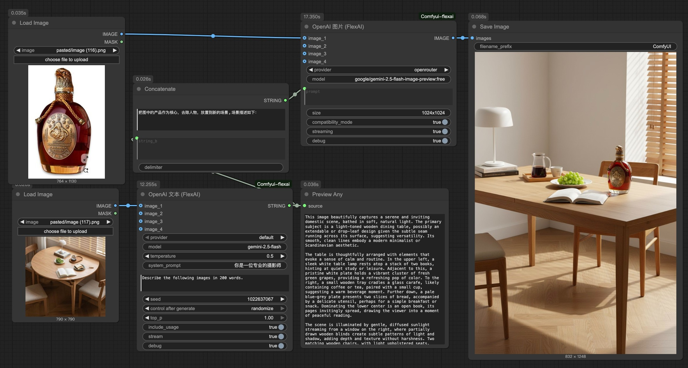
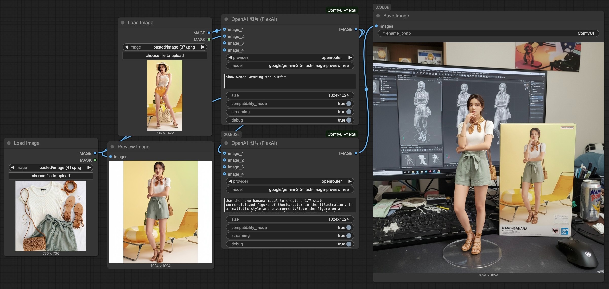

<!-- 双语链接 -->
[English](README.md) | 中文 / Chinese

# ComfyUI FlexAI 插件

[](https://github.com/your-repo/Comfyui-flexai)
[](LICENSE)

现代化的统一 ComfyUI 插件，支持 OpenAI 兼容 API，具备增强调试功能和双模式图像处理能力。

写这个插件主要为了简化自己的工作，通过标准化的openai接口就可是接入llm或图片生成，最近用这个节点主要在玩 gemini-2.5-flash-image 的生成（没测过gemini官方接口，我接的是openai兼容端点），效果还不错。

## 最近更新
- 2025-9-2 1.0.1 优化debug模式下的出错提示，加入对openrouter上的免费模型的支持
- 2025-9-2 1.0发布,亲测接入[tuzi](https://api.tu-zi.com/)和[GB](https://github.com/snailyp/gemini-balance)一点没毛病
- 2025-8-31 插件初始化  

## ✨ 核心特性

### 🌐 多API来源支持
- **灵活配置**：通过 `.env` 文件支持多个 API 提供商，这样如果有多个token的渠道就不用切来切去了，可以共用。
- **动态切换**：无需重启 ComfyUI 即可切换提供商

### 🖼️ OpenAI 图片节点 (`flexai:openai_image`)

**双模式运行：**
- **编辑模式**：提供 1-4 张图片 → 使用 `images.edit` API
- **生成模式**：无图片输入 → 使用 `images.generate` API


### 💬 OpenAI 文本节点 (`flexai:openai_text`)

**多模态文本生成：**
- 纯文本或视觉语言理解
- 支持 1-4 张参考图片，自动缩放
- 流式和非流式模式
- **调试模式**：所有操作的完整 JSON 日志记录

## 快速开始

### 安装

1. 克隆到 ComfyUI 自定义节点目录：
   ```bash
   cd ComfyUI/custom_nodes
   git clone https://github.com/your-repo/Comfyui-flexai.git
   ```

2. 安装依赖：
   ```bash
   cd Comfyui-flexai
   pip install -r requirements.txt
   ```

3. 配置提供商（见配置章节）
4. 重启 ComfyUI

## 配置

在插件根目录创建 `.env` 文件,或复制 `.env.example` 文件并重命名。

### 单一提供商
```bash
OPENAI_API_KEY=your_openai_api_key_here
OPENAI_API_BASE=https://api.openai.com/v1  # 可选
```

### 多提供商（推荐）
```bash
# 定义提供商列表
OPENAI_PROVIDERS=openai,anthropic,custom

# OpenAI
OPENAI_API_KEY_openai=sk-your-openai-key
OPENAI_API_BASE_openai=https://api.openai.com/v1

# Anthropic（通过 OpenAI 兼容端点）
OPENAI_API_KEY_anthropic=sk-your-anthropic-key  
OPENAI_API_BASE_anthropic=https://api.anthropic.com/v1

# 自定义端点
OPENAI_API_KEY_custom=your-custom-key
OPENAI_API_BASE_custom=https://your-api.example.com/v1
```


## 节点参数

### 图片节点 (`flexai:openai_image`)

| 参数 | 类型 | 描述 |
|------|------|------|
| `provider` | 选择 | API 提供商选择 |
| `model` | 字符串 | 模型名称 (如 `dall-e-3`, `dall-e-2`) |
| `prompt` | 字符串 | 生成/编辑提示词 |
| `image_1-4` | 图片 | 可选图片（提供任意张则进入编辑模式） |
| `size` | 字符串 | 输出尺寸 (如 `1024x1024`) |
| `compatibility_mode` | 布尔 | **兼容模式**：启用后通过chat端点实现图像生成，兼容OpenRouter等第三方服务 |
| `debug` | 布尔 | **启用详细调试日志** |

### 文本节点 (`flexai:openai_text`)

| 参数 | 类型 | 描述 |
|------|------|------|
| `provider` | 选择 | API 提供商选择 |
| `model` | 字符串 | 模型名称 (如 `gpt-4o`, `gpt-3.5-turbo`) |
| `system_prompt` | 字符串 | 系统消息 |
| `user_prompt` | 字符串 | 用户消息 |
| `image_1-4` | 图片 | 可选参考图片 |
| `max_tokens` | 整数 | 最大响应令牌数 |
| `temperature` | 浮点 | 采样温度 (0.0-1.0) |
| `stream` | 布尔 | 启用流式模式 |
| `debug` | 布尔 | **启用详细调试日志** |

---

## 示例工作流

### 产品放置 (Product Placement)

[下载工作流](workflows/flexai-product-placement.json)

### 手办换装 (Figure Redress)

[下载工作流](workflows/flexai-figure-redress.json)

---

为 ComfyUI 社区用 ❤️ 构建
