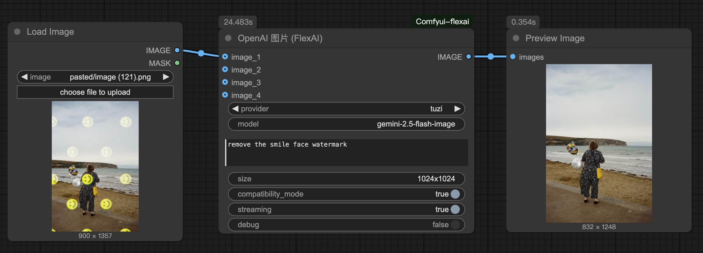

<!-- Bilingual Links -->
English | [中文 / Chinese](README-zh.md)

# ComfyUI FlexAI Plugin

[](https://github.com/your-repo/Comfyui-flexai)
[](LICENSE)

A modern, unified ComfyUI plugin for OpenAI-compatible APIs with enhanced debugging and dual-mode image processing capabilities.

I wrote this plugin mainly to simplify my own workflow, allowing access to LLM or image generation through standardized OpenAI interfaces. Recently, I've been mainly using this node to play with Gemini-2.5-Flash-Image generation (haven't tested the official Gemini interface, I'm connecting to an OpenAI-compatible endpoint), and the results are quite good.

## Recent Updates
- 2025-9-3 v1.0.5 **Model Memory & Management**: Added a persistent model list for both image and text nodes, with major code refactoring for maintainability.
- 2025-9-3 v1.0.4 **Multi-Image Return**: The image node can now process and output multiple images at once, resolving size mismatch and data type errors.
- 2025-9-3 v1.0.3 Fixed a bug in stream response handling and improved debug logging.
- 2025-9-3 v1.0.2 Added OpenRouter support (with streaming), debug info merged to debug.log
- 2025-9-2 v1.0.1 Optimized error messages in debug mode, added support for free models on OpenRouter
- 2025-9-2 v1.0 release, tested integration with [tuzi](https://api.tu-zi.com/) and [GB](https://github.com/snailyp/gemini-balance) works perfectly
- 2025-8-31 Plugin initialization

## ✨ Key Features

### 🌐 Multiple API Sources Support
- **Flexible Configuration**: Support multiple API providers via `.env` file, so if you have multiple token channels you don't have to switch back and forth, they can be shared.
- **Dynamic Selection**: Switch between providers without restarting ComfyUI
- **Model Memory & Management**: Select favorite models from a dropdown or add a new one in the `custom_model` field. **Run it once** to save it automatically for future use.

### 🖼️ OpenAI Image Node (`flexai:openai_image`)

**Dual-Mode Operation:**
- **Edit Mode**: Provide 1-4 images → Uses `images.edit` API
- **Generate Mode**: No images → Uses `images.generate` API

**Compatibility Mode**: Generate images via chat endpoint, compatible with OpenRouter and other third-party OpenAI-compatible interfaces

### 💬 OpenAI Text Node (`flexai:openai_text`)
**Multimodal Support:**
- **Text-Only Mode**: Standard text generation
- **Vision Mode**: Support image input for visual Q&A
- **Hybrid Mode**: Combined text and image analysis


**Multimodal Text Generation:**
- Pure text or vision-language understanding
- Support 1-4 reference images with auto-scaling
- Streaming and non-streaming modes
- **Debug Mode**: Complete JSON logging for all operations

## Quick Start

### Installation

1. Clone to ComfyUI custom nodes:
   ```bash
   cd ComfyUI/custom_nodes
   git clone https://github.com/your-repo/Comfyui-flexai.git
   ```

2. Install dependencies:
   ```bash
   cd Comfyui-flexai
   pip install -r requirements.txt
   ```

3. Configure providers (see Configuration section)
4. Restart ComfyUI

## Configuration

Create a `.env` file in the plugin root directory.

### Single Provider
```bash
OPENAI_API_KEY=your_openai_api_key_here
OPENAI_API_BASE=https://api.openai.com/v1  # Optional
```

### Multiple Providers (Recommended)
```bash
# Define provider list
OPENAI_PROVIDERS=openai,anthropic,custom

# OpenAI
OPENAI_API_KEY_openai=sk-your-openai-key
OPENAI_API_BASE_openai=https://api.openai.com/v1

# Anthropic (via OpenAI-compatible endpoint)
OPENAI_API_KEY_anthropic=sk-your-anthropic-key  
OPENAI_API_BASE_anthropic=https://api.anthropic.com/v1

# Custom endpoint
OPENAI_API_KEY_custom=your-custom-key
OPENAI_API_BASE_custom=https://your-api.example.com/v1
```

## Node Parameters

### Image Node (`flexai:openai_image`)

| Parameter | Type | Description |
|-----------|------|-------------|
| `provider` | Choice | API provider selection |
| `model` | String | Model name (e.g., `dall-e-3`, `dall-e-2`) |
| `prompt` | String | Generation/editing prompt |
| `image_1-4` | Image | Optional images (edit mode if any provided) |
| `size` | String | Output size (e.g., `1024x1024`) |
| `compatibility_mode` | Boolean | **Compatibility Mode**: Enable chat endpoint for image generation, compatible with OpenRouter and other third-party services |
| `stream` | Boolean | Enable streaming mode |
| `debug` | Boolean | **Enable detailed debug logging** |

### Text Node (`flexai:openai_text`)

| Parameter | Type | Description |
|-----------|------|-------------|
| `provider` | Choice | API provider selection |
| `model` | String | Model name (e.g., `gpt-4o`, `gpt-3.5-turbo`) |
| `system_prompt` | String | System message |
| `user_prompt` | String | User message |
| `image_1-4` | Image | Optional reference images |
| `max_tokens` | Integer | Maximum response tokens |
| `temperature` | Float | Sampling temperature (0.0-1.0) |
| `stream` | Boolean | Enable streaming mode |
| `debug` | Boolean | **Enable detailed debug logging** |

---

## Example Workflows

### Product Placement

[Download Workflow](workflows/flexai-product-placement.json)

### Figure Redress

[Download Workflow](workflows/flexai-figure-redress.json)

---

Built with ❤️ for the ComfyUI community
